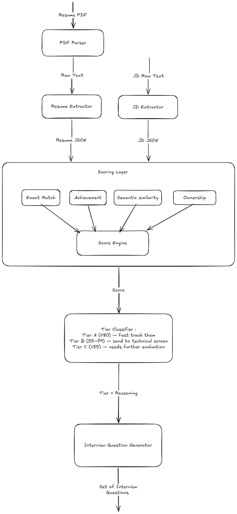

# 🎯 Resume Shortlister — AI-Powered Candidate Screening Engine

[](https://ai-resume-shortlisting-interview-assistant-evct59wrbs6hnmrnnmd.streamlit.app/)
[](https://python.org)
[](https://console.groq.com)

An intelligent resume screening system that parses resumes, scores candidates
across 4 dimensions, classifies them into hiring tiers, and generates tailored
interview plans — powered by **Groq** (LLaMA 3.3 70B).

🚀 **[Try the live demo →](https://ai-resume-shortlisting-interview-assistant-evct59wrbs6hnmrnnmd.streamlit.app/)**

---

## What It Does

Given a **resume PDF** and a **job description**, the system:

1. **Parses** both into structured JSON
2. **Scores** the candidate across 4 independent dimensions:
   - Exact Skill Match
   - Semantic Similarity
   - Achievement Quality
   - Ownership Signals
3. **Classifies** the candidate into Tier A / B / C with reasoning
4. **Generates** a tailored 5–8 question interview plan with rationale per question

Every score comes with a plain-English explanation.

---

## Live Demo

Try it instantly — no setup required:

**[https://ai-resume-shortlisting-interview-assistant-evct59wrbs6hnmrnnmd.streamlit.app/](https://ai-resume-shortlisting-interview-assistant-evct59wrbs6hnmrnnmd.streamlit.app/)**

Upload any text-based resume PDF, paste a job description, and get a full candidate assessment in ~30 seconds.

---

## Quickstart (Run Locally)

### 1. Clone the repo
```bash
git clone https://github.com/hadi-zedex/AI-Resume-Shortlisting-Interview-Assistant.git
cd AI-Resume-Shortlisting-Interview-Assistant
```

### 2. Set up a virtual environment
```bash
python -m venv venv
source venv/bin/activate        # Windows: venv\Scripts\activate
```

### 3. Install dependencies
```bash
pip install -r requirements.txt
```

### 4. Configure your API key
```bash
cp .env.example .env
# Open .env and add your Groq API key (free at https://console.groq.com):
# GROQ_API_KEY=your_api_key_here
```

### 5. Run the Streamlit UI
```bash
streamlit run ui/app.py
```

Or run the pipeline directly from the CLI:
```bash
python -m src.main \
  --resume data/sample_resumes/sample.pdf \
  --jd data/sample_jds/backend_engineer.txt
```

**Expected output:**
```
[PDFParser]       Extracted 3,842 characters from resume.
[ResumeExtractor] Parsed candidate: Jane Smith
[JDExtractor]     Parsed JD: Senior Backend Engineer
[ScoringEngine]   Scoring 'Jane Smith' for 'Senior Backend Engineer'...
[ScoringEngine]   Done. Overall: 74.3 | Exact: 80.0 | Semantic: 71.0 | Achievement: 68.0 | Ownership: 72.0
[TierClassifier]  'Jane Smith' → Tier B (score: 74.3)
[QuestionGenerator] Generating interview plan...

━━━━━━━━━━━━━━━━━━━━━━━━━━━━━━━━━━━━━━━━
CANDIDATE:   Jane Smith
ROLE:        Senior Backend Engineer
TIER:        B — Proceed to technical screen
SCORE:       74.3 / 100
━━━━━━━━━━━━━━━━━━━━━━━━━━━━━━━━━━━━━━━━
```

---

## Architecture

See [`docs/SYSTEM_DESIGN.md`](docs/SYSTEM_DESIGN.md) for the full architecture document.

### High-level flow


### Project structure
```
ui/                     # Streamlit web interface
src/
├── models/             # Pydantic data contracts
├── parser/             # PDF extraction + LLM-based structuring
├── scorer/             # 4 independent scorers + engine orchestrator
├── classifier/         # Tier assignment + focus area derivation
├── questions/          # Interview plan generator
└── llm/                # Groq client wrapper (OpenAI-compatible) + prompt templates
```

---

## Assumptions & Trade-offs

### Assumptions

- **Resumes are text-based PDFs**, not scanned images. OCR is not included.
  Most modern resumes (exported from Word, Google Docs, or resume builders) work fine.

- **Job descriptions are plain text**. Copy-paste from LinkedIn, Greenhouse,
  or any job portal. PDF JDs are not supported.

- **English only**. The prompts and scoring logic are tuned for English-language
  resumes and JDs.

- **One candidate per PDF**. The parser extracts a single `CandidateProfile`
  per file. Multi-resume PDFs are not handled.


### Trade-offs

| Decision | Trade-off |
|---|---|
| LLM-based semantic similarity over embeddings | More explainable, no vector DB needed, but slower and costs API calls |
| 4 separate LLM calls per candidate | Better separation of concerns and explainability vs. one large prompt |
| `pdfplumber` for PDF parsing | Fast and reliable for text PDFs, but fails completely on scanned images |
| Pydantic for all data models | Strong type safety and validation, small overhead vs. plain dicts |
| Singleton pattern for scorers and clients | Simple to use across the codebase, not suitable for multi-threaded scaling |
| Weighted average for overall score | Transparent and configurable, but assumes dimensions are independent |
| Groq (LLaMA 3.3 70B) over proprietary models | Free tier available, very fast inference, open-weight model |

---

## Known Limitations

- **Scanned PDFs fail silently** — if a PDF has no extractable text, the parser
  raises a clear error but cannot fall back to OCR.

- **No batch processing** — the current implementation processes one candidate
  at a time synchronously. For high-volume screening, a queue-based async
  architecture (Celery + Redis) would be needed.

- **LLM non-determinism** — scores can vary slightly between runs for the same
  resume. Exact match scoring is deterministic; the three LLM-based scores are not.

- **No caching** — if the same JD is scored against 50 resumes, the JD
  extraction LLM call runs 50 times. JD extraction results should be cached by
  JD hash in a production system.

- **Skill coverage is shallow for niche domains** — the semantic similarity
  scorer works well for mainstream tech stacks. For highly specialised domains
  (e.g. embedded systems, quantum computing), the LLM's equivalence judgements
  may be less reliable.

- **No human feedback loop** — scores are not calibrated against real hiring
  outcomes. A production system would incorporate recruiter accept/reject
  decisions to retrain or re-weight the scoring model over time.

### What I'd build next

1. **Batch processing** — Celery + Redis queue for screening 100+ candidates
2. **JD caching** — cache parsed JDs by content hash to avoid redundant API calls
3. **OCR fallback** — integrate `pytesseract` for scanned PDF support
4. **Score calibration** — recruiter feedback loop to adjust dimension weights
5. **REST API** — FastAPI wrapper so the engine can be called as a microservice
6. **Export to PDF** — generate a formatted candidate assessment report

---

## AI Tools Used

- Used ChatGPT for research
- Used Excalidraw for creating diagrams
- Used Claude for architecture ideas and coding assistance

LLM calls are used for the following tasks:

| Task | Why AI, not code |
|---|---|
| Resume → structured JSON | Resumes have no standard format. Regex and rules fail on real-world variety. |
| JD → structured JSON | Same reason — JD formats vary wildly across companies and portals. |
| Semantic similarity scoring | Requires reasoning about technology equivalence — not a lookup table problem. |
| Achievement + Ownership scoring | Requires understanding language nuance — "led" vs "assisted" vs "owned". |
| Interview question generation | Requires synthesising candidate profile + gaps into contextual questions. |

### Where I agreed with AI suggestions

- Using LLM-based semantic similarity over embeddings — the explainability
  benefit (a natural language reason per match) is more valuable for this use
  case than marginal accuracy gains from a vector approach.

- Keeping prompts in separate files under `llm/prompts/` — initial instinct was
  to inline prompts in the scorer files. Separating them makes them reviewable,
  testable, and iterable independently.

### Where I disagreed with AI and why

- **Single large prompt vs. 4 separate calls** — an initial suggestion was to
  score all 4 dimensions in one large call to reduce latency. I disagreed:
  separate calls keep each scorer independently testable, produce cleaner
  outputs, and make debugging much easier. The latency cost is acceptable for
  this use case.

- **`CandidateProfile(**raw_json)` for model construction** — an early approach
  was to unpack the LLM's JSON directly into Pydantic models. I replaced this
  with manual field-by-field construction because direct unpacking crashes on
  any unexpected field, and the manual approach gives graceful fallbacks and
  clear error messages per field.

---

## Configuration

All tunable settings live in `src/config.py`:
```python
# Scoring weights (must sum to 1.0)
WEIGHT_EXACT_MATCH          = 0.30
WEIGHT_SEMANTIC_SIMILARITY  = 0.30
WEIGHT_ACHIEVEMENT          = 0.20
WEIGHT_OWNERSHIP            = 0.20

# Tier thresholds
TIER_A_MIN_SCORE = 80.0
TIER_B_MIN_SCORE = 55.0
```

---

## Requirements

- Python 3.11+
- Groq API key (free at [console.groq.com](https://console.groq.com))
- See `requirements.txt` for full dependency list

---
